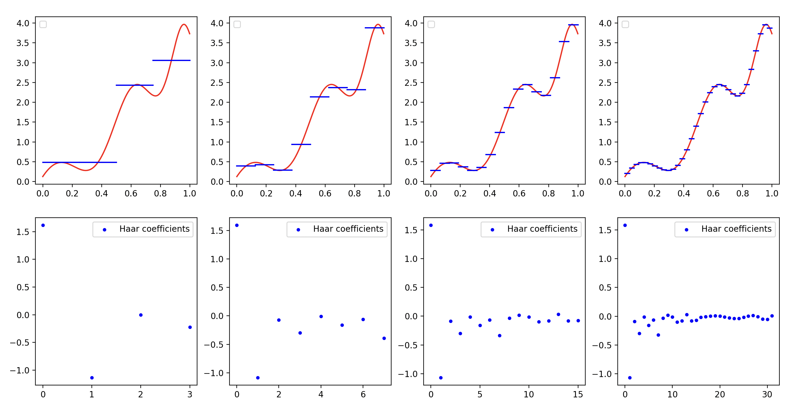
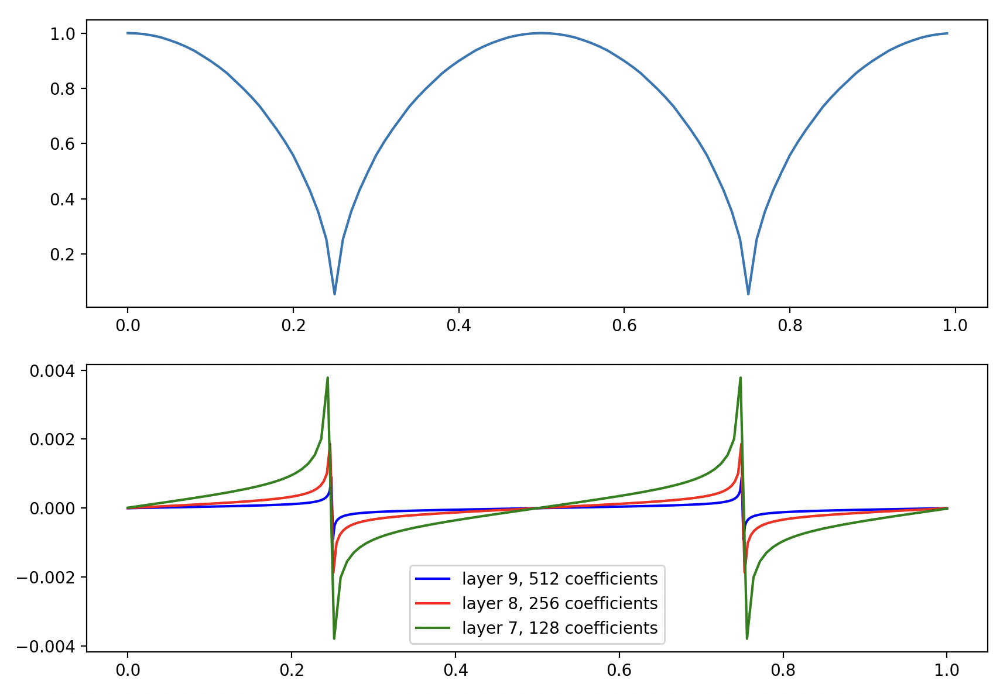
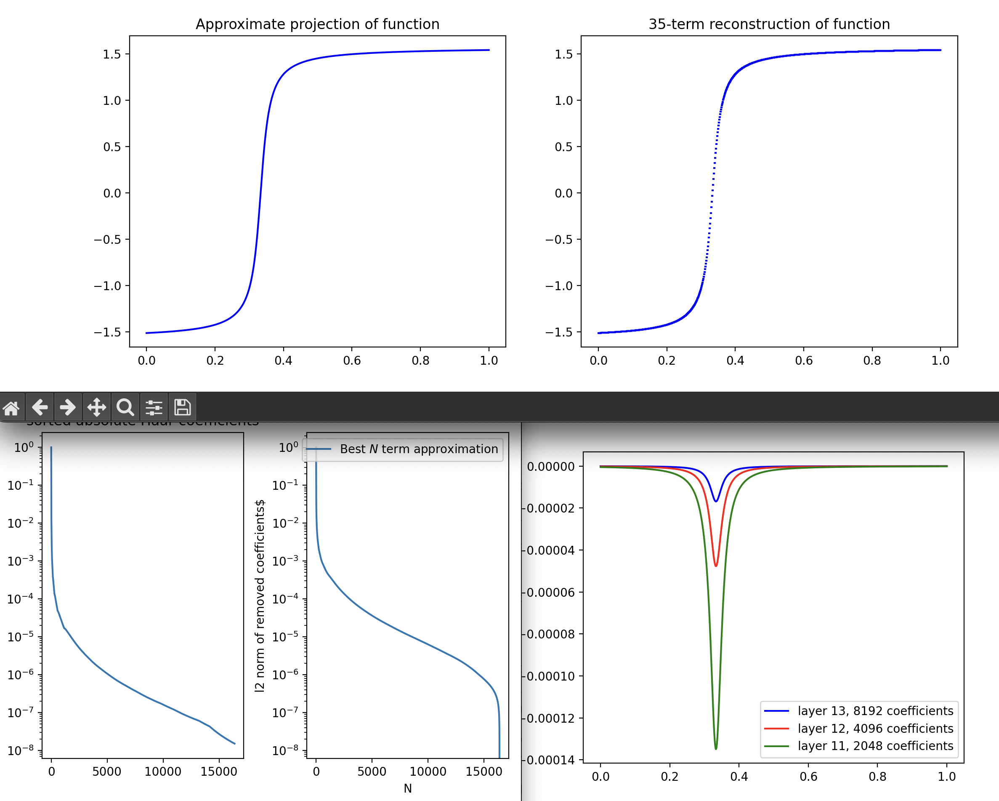

Code written during the mathematics course `Wavelets` at the University of Amsterdam

# Haar transform

Efficient (and inefficient) implementations, DHT, iDHT, FHT, and iFHT. Here showing a function in Haar basis:

Here shown how coefficients in the Haar Basis decay based on the local smoothness of the function:

Here shown how the Haar basis can be used to compress functions and retain most of their $L_2$ norm while keeping only 0.02% of the coefficients.

# Fast Fourier Transform and Multiresolution analysis

Implemented fast polynomial multiplication in coefficient form by: first evaluating them both in the same 2n distinct points using fast fourier transform, then multiplying their function output pointwise, and then mapping it back to the unique polynomial that goes through all those points.

There is no nice picture to show here as most of it happens in the complex plane. But it is very very elegant!!